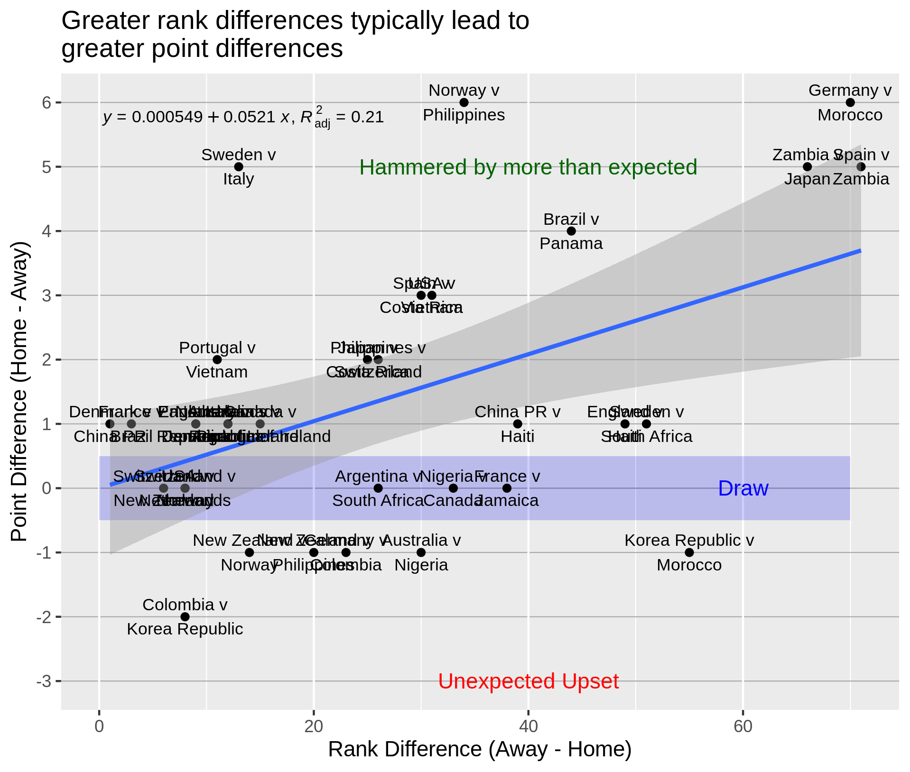

# FIFA Women's World Cup 2023

Exploring the relationship between rank difference before the group stage, and points difference in pool games.

Three scripts, in order. Each can be run independently from stored data, saved at the end of the previous script.

"1 API to get data.R"

Reads in data by API from www.APIfootball.com.

Sign up on web and store key in a text file named "creds.txt" on line 1, no inverted commas. 

"2 Wrangle data.R"

Reads in ranks from Excel, copied from FIFA website.

Fixes country names that were inconsistent.

"3 Plot Data.R"

Creates variables and then plots!

